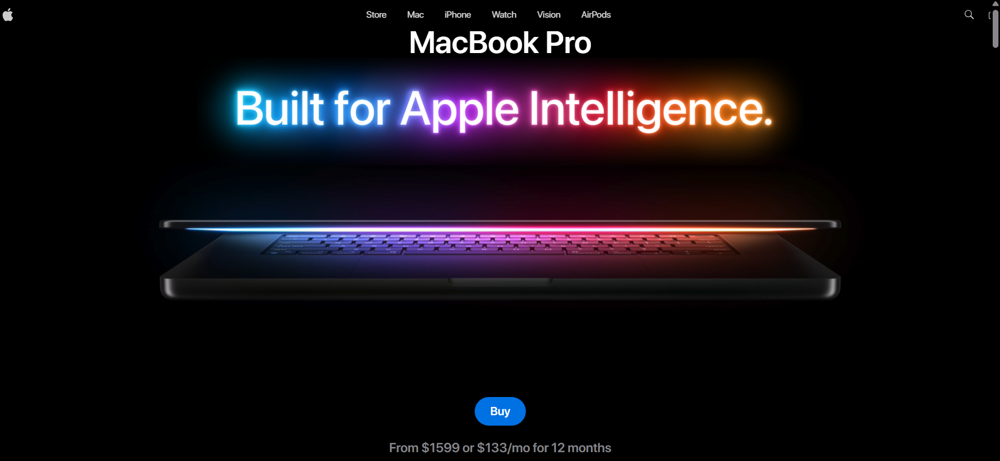

<div align="center">
  
  
  
  
</div>

<h1 align="center">🍎 Apple-Inspired MacBook 3D Landing Page</h1>

<p align="center">
  <a href="https://gsap-macbook-landing-main-five.vercel.app/" target="_blank" rel="noopener noreferrer">
    
  </a>
</p>

<p align="center">
  <a href="https://gsap-macbook-landing-main-five.vercel.app/" target="_blank" rel="noopener noreferrer">
    <strong>Live demo → https://gsap-macbook-landing-main-five.vercel.app/</strong>
  </a>
</p>

---

## 📋 Table of Contents

- [✨ Introduction](#-introduction)  
- [⚙️ Tech Stack](#-tech-stack)  
- [🔋 Features](#-features)  
- [🤸 Quick Start](#-quick-start)  
- [🖼 Screenshots](#-screenshots)  
- [🤝 Contributing](#-contributing)  
- [📄 License](#-license)  
- [✉️ Contact](#-contact)

---

## ✨ Introduction

A modern **Apple-style 3D landing page** built with **React**, **Three.js**, **GSAP**, and **Tailwind CSS**.  
This project showcases immersive 3D scenes, scroll-based animations, and dynamic transitions.  
It’s designed for developers who want to create **interactive, visually engaging web experiences** with smooth animations and responsive layouts.

---

## ⚙️ Tech Stack

### 🧠 Core Libraries
- **[React](https://react.dev/)** — Declarative UI library providing a component-based structure and seamless integration with GSAP for dynamic animations.  
- **[Three.js](https://threejs.org/)** — JavaScript 3D library powering WebGL-based rendering, interactive lighting, textures, and model animations.  
- **[GSAP](https://gsap.com/)** — High-performance animation library used for scroll-triggered timelines, parallax effects, and fluid transitions.  
- **[Tailwind CSS](https://tailwindcss.com/)** — Utility-first CSS framework for rapid and responsive UI styling.  
- **[Zustand](https://zustand-demo.pmnd.rs/)** — Lightweight state management library for global state handling without unnecessary re-renders.  
- **[Vite](https://vitejs.dev/)** — Lightning-fast build tool and dev server with instant HMR and optimized builds.

---

## 🔋 Features

- ⚡ **3D Product Scene with Realistic Lighting** — Showcase MacBook models in lifelike 3D environments.  
- 🌀 **Scroll-Based 3D Animations** — Animate objects based on user scroll position for immersive interactivity.  
- 🎯 **GSAP ScrollTrigger Effects** — Control animations, pin sections, and sync timelines with scroll behavior.  
- 📸 **Image Masking & Transition Effects** — Use scroll-driven masks and reveals for striking visual storytelling.  
- ⏱ **Seamless Timeline Animations** — Create fluid, section-spanning transitions using GSAP’s timeline API.  
- 📱 **Fully Responsive Design** — Optimized for all screen sizes with adaptive animations and layouts.

---

## 🤸 Quick Start

Follow these steps to set up and run the project locally.

### 🔧 Prerequisites

Ensure you have the following installed:
- [Git](https://git-scm.com/)
- [Node.js](https://nodejs.org/en)
- [npm](https://www.npmjs.com/)

---

### 📥 Clone the Repository
```bash
git clone https://github.com/Vishuddhijain/gsap_macbook_landing.git
cd gsap_macbook_landing
````

---

### 📦 Install Dependencies

```bash
npm install
```

---

### 🚀 Run the Development Server

```bash
npm run dev
```

Then open [http://localhost:5173](http://localhost:5173) in your browser to preview the project.

---

## ✅ Production / Deployment

Deployed on Vercel:
**Live demo:** [https://gsap-macbook-landing-main-five.vercel.app/](https://gsap-macbook-landing-main-five.vercel.app/)

---

## 🤝 Contributing

Contributions & feedback welcome!

* Fork the repo
* Create a branch: `git checkout -b feat/your-feature`
* Commit your changes: `git commit -m "feat: description"`
* Push: `git push origin feat/your-feature`
* Open a PR describing your changes

If you submit code that requires API keys, please add them to `.env` and **do not** commit secrets.

---

## 📄 License

This repository is provided under the `MIT` license. See `LICENSE` for details.

---

## ✉️ Contact

Vishuddhi Jain — [vishuddhi0303.jain@gmail.com](mailto:vishuddhi0303.jain@gmail.com)
Project: [https://github.com/Vishuddhijain/gsap_macbook_landing](https://github.com/Vishuddhijain/gsap_macbook_landing)
Live demo: [https://gsap-macbook-landing-main-five.vercel.app/](https://gsap-macbook-landing-main-five.vercel.app/)

---

<p align="center">Built with ❤️ using React, GSAP, Three.js, and Tailwind CSS.</p>
```
